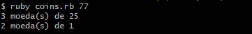

<h1 align="center">Problemas das moedas</h1>

Dado um número infinito de moedas de 25, 10, 5 e 1 centavos, o código calcula a quantidade de possibilidades de representar X centavos de troco.

## Exemplo:

Dado 77 centavos, o código irá retornar 3 moedas de 25 + 2 moedas de 1.

## Modo de usar:

Entre na pasta onde se encontra o código. Execute o seguinte comando:
- ruby coins.rb (quantidade de moedas desejadas)

<!DOCTYPE html>
<html>
<body>

</body>
</html>